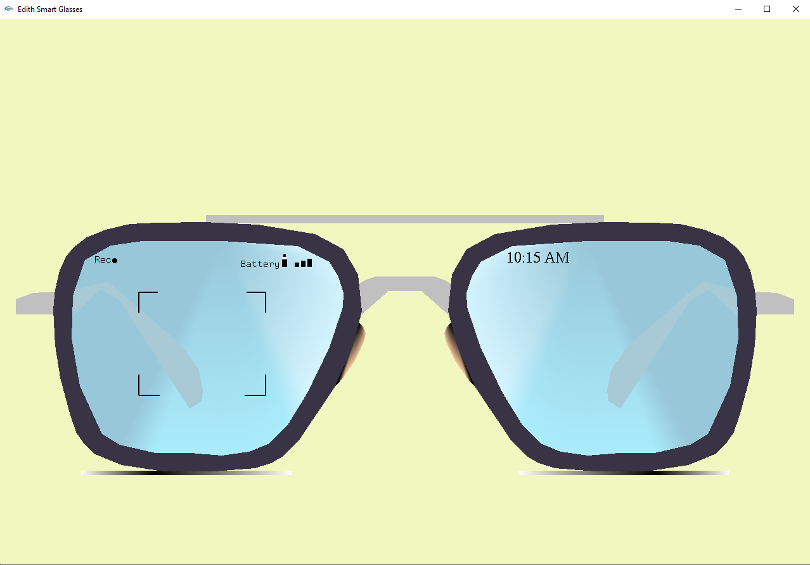

# Smart Glasses (Edith Glasses) Rendering with OpenGL

## Overview

This project demonstrates how to render a simple 2D image of smart glasses using OpenGL in C++. The image is constructed using basic geometric shapes such as lines, rectangles, and circles, leveraging OpenGL's vertex specification and drawing functions. This project serves as an introductory exercise in understanding the fundamental concepts of OpenGL, including vertices, shapes, and basic transformations.

## Features

- **Simple Geometric Shapes**: The smart glasses are composed of basic shapes including rectangles for the frame, circles for the lenses, and lines for the temples.
- **Vertex Specification**: The project demonstrates how to specify vertices and use them to draw shapes.
- **Coloring**: Different parts of the glasses are colored to distinguish various components.
- **Basic Transformations**: Apply basic transformations such as translation and scaling to position and size the glasses appropriately.

## Usage

After building the project, run the executable to see the rendered image of the smart glasses:
```sh
./smart_glasses
```

A window should open displaying the 2D rendering of the smart glasses.

## Code Highlights

- **Vertex Specification**: Vertices are specified using `glVertex2f` for 2D rendering.
- **Primitive Shapes**: The project uses `GL_POLYGON` for rectangles and circles, and `GL_LINES` for drawing lines.
- **Basic Coloring**: Colors are set using `glColor3f` to differentiate parts of the glasses.
- **Transformation**: Basic transformations like translation and scaling are applied to position the glasses in the window.

## Learning Objectives

- **Understanding OpenGL Basics**: Gain familiarity with the basics of OpenGL including initializing a window, setting up a rendering context, and drawing simple shapes.
- **Working with Vertices**: Learn how to define and manipulate vertices to create geometric shapes.
- **Applying Transformations**: Understand how to apply basic transformations to objects in OpenGL.
- **Rendering 2D Graphics**: Gain experience in rendering 2D graphics, which is a fundamental skill for more advanced 3D graphics programming.

## Further Reading

To deepen your understanding of the concepts used in this project, consider exploring the following topics:
- **OpenGL Documentation**: The official [OpenGL documentation](https://www.opengl.org/documentation/) provides comprehensive information on all OpenGL functions and features.
- **GLUT Documentation**: The [GLUT API](https://www.opengl.org/resources/libraries/glut/) is essential for creating windows and handling user input in OpenGL applications.
- **OpenGL Tutorials**: Websites like [learnopengl.com](https://learnopengl.com/) offer tutorials ranging from basic to advanced OpenGL programming.

By completing this project, you will have a solid foundation in basic OpenGL programming, which will serve as a stepping stone for more complex graphics projects.

## Contributing

Contributions are welcome! If you have suggestions for improvements or new features, please create a pull request or open an issue.

## License

This project is licensed under the MIT License. See the `LICENSE` file for more details.